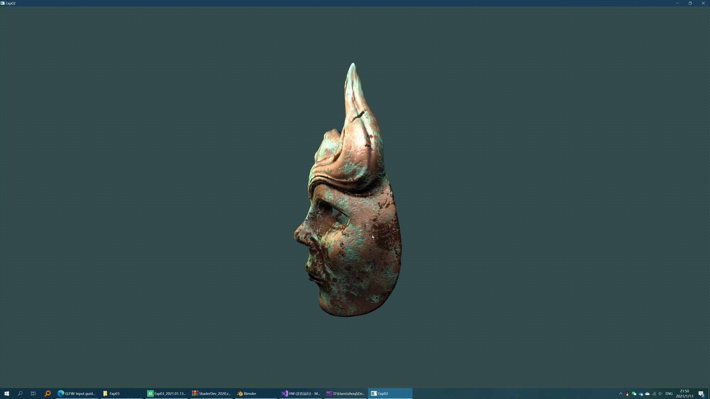
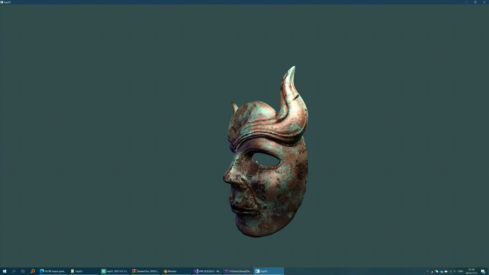
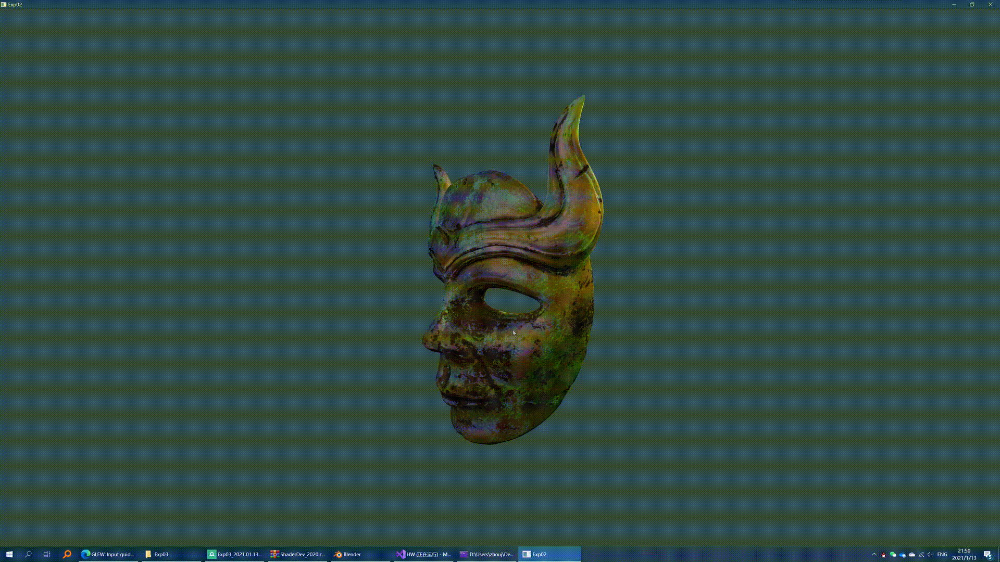

# 综述

## 预装环境

* Windows 10
* Visual Studio 2017或2019
* CMake

## 本实验使用的框架

* GLFW和配套的GLAD（OpenGL 3.3 Loader）。
* Luna（自己开发的一个图形应用程序框架，这里只使用了数学运算的部分）。

## 编译方法

1. 在所有预装环境安装完毕以后，双击`gen_vs2017.bat`或者`gen_vs2019.bat`。

2. 使用Visual Studio打开`Solution/HW.sln`。

3. 编译任意作业（`Exp1`，`Exp2`，`Exp3`），所有依赖库会一起编译。

# 编程作业1：OpenGL基本程序 (Code/Exp1)

## 要求

- 使用glfw和glew搭建OpenGL基本框架
  - 也可以使用glut或者Qt等其他框架
- 实现基本模型绘制
  - 绘制立方体、圆球或者茶壶
- 实现相机控制
  - 支持从不同视角和距离观察模型

## 完成情况

- 使用glfw搭建了OpenGL基本框架

- 实现了立方体的绘制

- 实现了相机控制

  - WSADQE控制相机的前后左右上下移动。
  - 鼠标左键按住以后可以旋转相机，以看向不同的位置。

# 编程作业2：

## 要求

- 必选特性：
  - 光照
    - 太阳为光源
  - 纹理
    - 使用图片进行纹理映射
- 可选特性
  - 使用顶点着色器和片段着色器
    - 自己实现光照效果
  - 鼠标选择
    - 点击不同球体显示不同名称

## 完成情况

1. 绘制了太阳、地球和月球，均使用纹理映射。
2. 使用自己编写的着色器实现所有光照效果。
3. 太阳作为自发光球体绘制。
4. 使用太阳作为点光源计算地球和月球的光照，使用Blinn-Phong局部光照模型。
5. 对于地球，使用自定义着色器实现了夜半球亮灯的效果，并且针对大陆和海洋使用了不同反射率的材质参数，并实现了云层效果。
6. 绘制背景天空球，并使用银河系纹理。天空球不会随着相机的移动而产生相对位移（即绑定在相机上）。
7. 实现了地球、月球的公转和自传。
8. 相机控制和实验一保持一致。

## 演示GIF

## 参考

纹理来源：[Solar Textures]([Solar Textures | Solar System Scope](https://www.solarsystemscope.com/textures/))

# 编程作业3：复杂三维模型显示

## 要求

1. 支持以下三维模型文件格式中至少1种：

   * OBJ

   * 3DS

   * STL

2. 支持多个光源的光照效果，使用着色器渲染

3. 支持多种视点浏览方式
   * 以模型为中心的平移旋转和缩放
   * 以视点为中心的场景漫游

## 完成情况

1. 实现8个动态点光源的渲染，其中3个白色固定光源作为底光，5个纯色旋转光源以体现光照效果。
2. 使用TinyObjLoader加载OBJ模型，并在加载时计算法线贴图需要的切线信息。
3. 使用了改进的Blinn-Phong光照模型，使用漫反射贴图、镜面反射贴图来控制反射细节，并使用了法线贴图增加表面凹凸细节。
4. 实现了以模型为中心的平移旋转和缩放以及以视点为中心的场景漫游。控制方法为：
   1. 默认情况下使用以视点为中心的场景漫游，按住鼠标左键转动视角，使用`WASD`键控制前后左右移动，使用`Q`和`E`控制镜头升降。
   2. 按住`Z`键以后进入以模型为中心的视角，按住鼠标左键旋转，鼠标右键平移，鼠标中键缩放。
   3. 按`F`键可以将视点中心重设在模型中心上。

## 演示GIF

1. 光照展示：

2. 自由视角：

3. 旋转

4. 平移

5. 缩放

