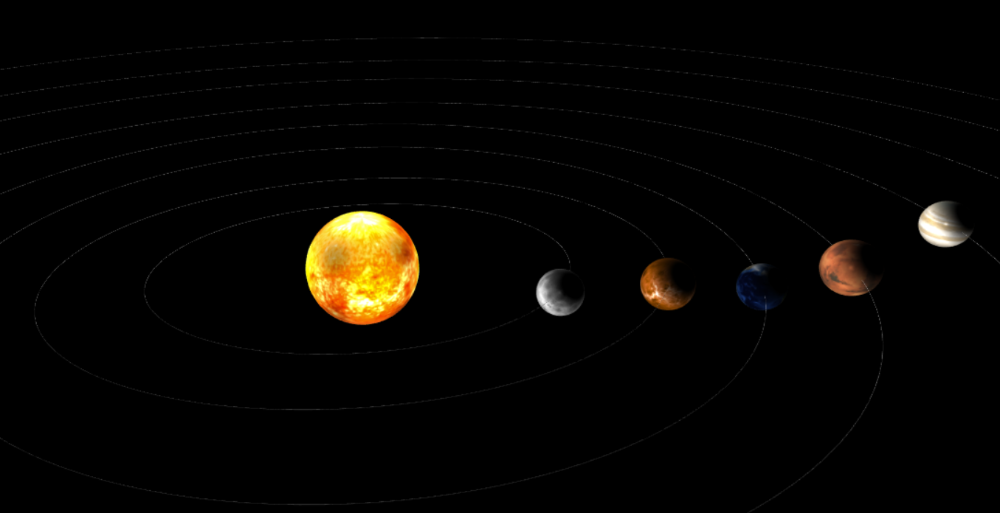
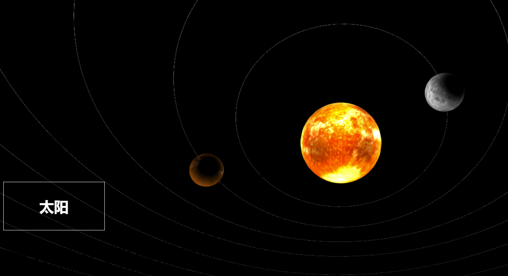

# 作业要求

- 光照：太阳为光源

- 纹理：使用图片做纹理映射

- 使用顶点着色器和片段着色器做光照

- 鼠标选择

# 作业说明

效果图如下：

绘制了太阳和八大行星，自定义shader，实现了phong模型、简单的阴影效果和纹理映射。

实现了鼠标点击，显示名称。

[在线链接](https://emmaamme.github.io/graphics2020/project02/)

# 本地环境

nodejs

yarn