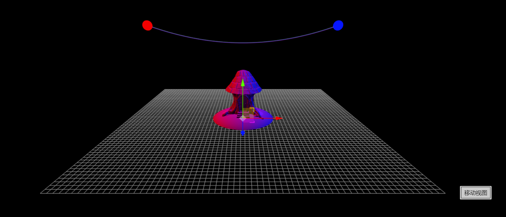

# 作业要求

- 支持obj\3ds\stl三维模型文件格式中的至少1种；
- 支持多个光源的光照效果，使用着色器渲染
- 支持多种视点浏览方式
  - 以模型为中心的平移旋转和缩放
  - 以视点为中心的场景漫游

# 作业说明

- 导入了stl文件格式做小屋子，两个灯泡是光源
- 使用自定义着色器定义了光照效果
- 点击下面的按钮切换变换模型还是视点
  - 鼠标控制平移/旋转
  - 鼠标滚动控制缩放
  

[在线链接](https://emmaamme.github.io/graphics2020/project03/)

# 本地环境

nodejs

yarn