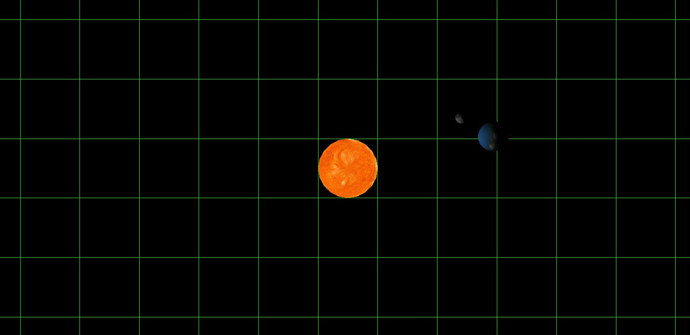
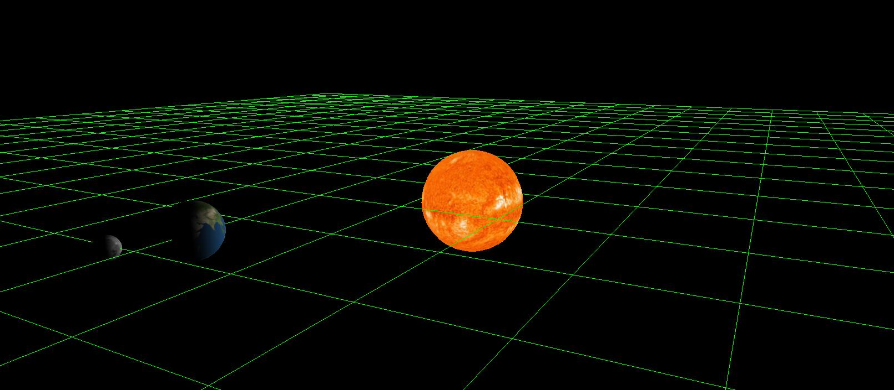
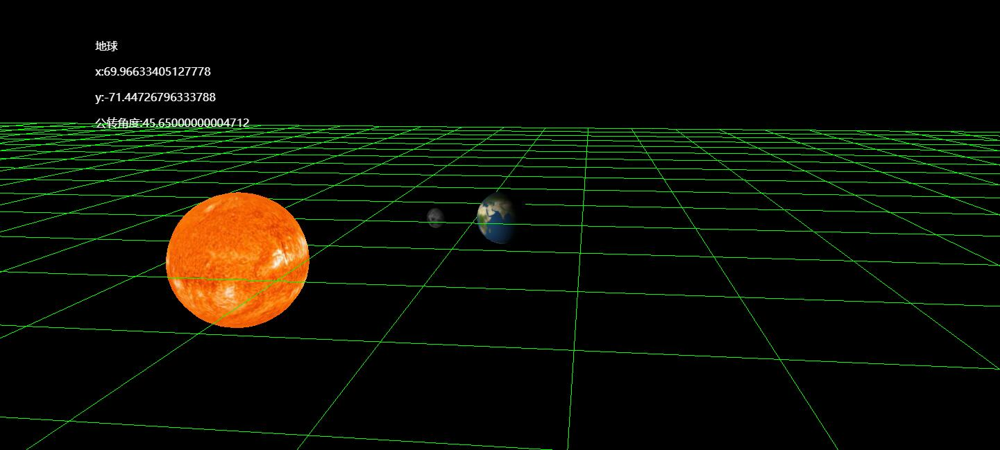
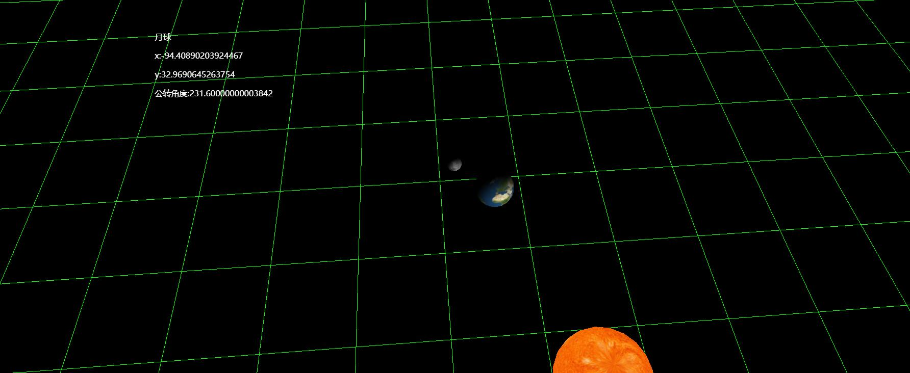

# Project02

## 基于 WebGL 和 Three.js 实现的太阳-地球-月球行星系统

开始之前需要安装 Node 并执行命令 `npm install` 来下载所需要的包。
下载完成后，执行 `npm start` 并打开浏览器访问 http://localhost:8081/ 即可浏览效果。
使用鼠标拖动即可实现角度切换，焦点默认锁定在太阳上。

## 已完成的特性

1.使用太阳为光源，将太阳作为点光源。 2.使用星球表面的图片进行纹理映射。 3.点击球体后会将控制器焦点锁定到该球体，并显示该球体的名称、坐标等信息。

## 效果预览

