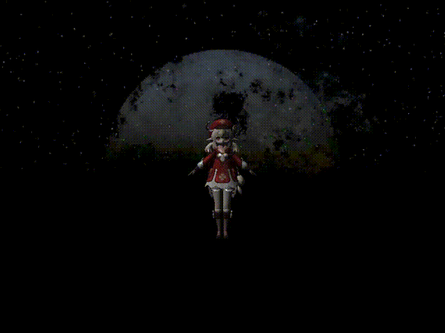

# 综述

## 环境

* Windows 10
* Visual Studio 2019

## 第三方库

* glfw
* glew
* glm
* assimp
* stb_image

# 编程作业1：OpenGL基本程序 (homework_1)

## 控制

- W/S 控制摄像机的前后移动
- A/D 控制摄像机的左右移动
- Q/E 控制摄像机的上下移动
- 滑动鼠标可以控制摄像机的方向
- 鼠标滚轮可以控制摄像机的视野

## 实现情况

- 场景的背景色为黑色
- 光照模型为Phong模型
- 物体包括
- 立方体
  - 球
  - 茶壶
  - 人物模型
  - 文件格式为obj
    - 位置在Debug文件夹中
- 可执行程序：Debug/homework_1.exe

## 调试环境

* Debug x86
* 附加库目录 ..\packages\glew.1.9.0.1\build\native\lib\v110\Win32\Debug\static
* 附加依赖项  opengl32.lib  glew.lib

# 编程作业2：行星程序（homework_2）

## 控制

- W/S 控制摄像机的前后移动
- A/D 控制摄像机的左右移动
- Q/E 控制摄像机的上下移动
- 滑动鼠标可以控制摄像机的方向
- 鼠标滚轮可以控制摄像机的视野
- F键，令摄像机转向太阳

## 实现情况

* 场景的背景为一个宇宙的天空盒
* 为了比较清除地观察行星，将环境光略微提亮
* 将太阳作为一个点光源进行光照，具有三个衰减项，光照模型为Phong模型
* 各个行星的半径、公转轨道半径以及自转公转轨道速度均按照现实中的数据进行等比例改变
* 太阳以及每个行星都有各自的纹理贴图
* 由于本程序将鼠标移动作为摄像机旋转的指标，并且隐藏了鼠标指针
  * 因此，使用“C”键替代鼠标的点击事件
  * 按下“C”键时，将在控制台输出摄像机前方对应的行星的的名称
* 模型包括一个太阳以及太阳系中的八个行星（还有一个月球）
  * 文件格式为obj
  * 模型和贴图文件位置在Debug文件夹中
* 可执行程序：Debug/homework_2.exe

## 调试环境

* Debug x86
* 附加库目录 ..\packages\glew.1.9.0.1\build\native\lib\v110\Win32\Debug\static
* 附加依赖项  opengl32.lib  glew.lib

## 演示

# 编程作业3：复杂三维模型显示（homework_3）

## 控制

- 实现了两种控制方式：
  - 以视点为中心的场景漫游（“Z”键切换）：
    - W/S 控制摄像机的前后移动
    - A/D 控制摄像机的左右移动
    - Q/E 控制摄像机的上下移动
    - 滑动鼠标可以控制摄像机的方向
    - 鼠标滚轮可以控制摄像机的视野
  - 以模型为中心的平移旋转和缩放（“X”键切换）：
    - W/S 控制模型的前后移动
    - A/D 控制模型的左右移动
    - Q/E 控制模型的上下移动
    - 滑动鼠标可以控制模型的旋转
    - 鼠标滚轮可以控制模型的缩放
  - F键，令摄像机转向世界坐标原点

## 实现情况

* 实现了obj格式模型文件的正确导入和显示
* 使用的模型为一个人物模型，由多个mesh和多张纹理贴图组成
* 模型和贴图文件位置在Debug文件夹中（包括天空盒）
* 场景中支持多个光源的光照效果，包括：
  * 1个平行光，颜色（1.0,1.0,1.0）（白色）
  * 4个点光源，颜色分别为
    * （1.0,0.0,0.0）（红色）
    * （0.0,1.0,1.0）（青色）
    * （1.0,0.0,1.0）（紫色）
    * （0.0,0.0,1.0）（蓝色）
    * 可通过按键“1”、“2”、“3”、“4”分别开启和关闭
  * 1个聚光灯，颜色（1.0,1.0,0.0）（黄色）
    * 使用聚光灯来模拟手电筒的效果，手电筒从摄像机的位置照向摄像机的前方
    * 按键“G”可以控制手电筒的开关
* 光照模型为Phong模型
* 模型会根据天空盒的贴图进行一定的反射（模型背面较平坦的网格部分效果较明显）
* 可执行程序：Debug/homework_3.exe

## 调试环境

* Debug x86
* 附加库目录 ..\packages\glew.1.9.0.1\build\native\lib\v110\Win32\Debug\static
* 附加依赖项  opengl32.lib  glew.lib

## 演示

