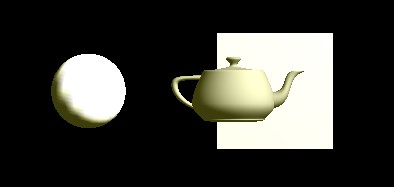
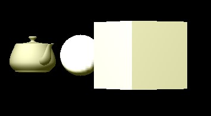

## 1.实验要求
+ 使用glfw和glew搭建OpenGL基本框架
也可以使用glut或者Qt等其他框架
+ 实现基本模型绘制
绘制立方体、圆球或者茶壶
+ 实现相机控制
支持从不同视角和距离观察模型
+ 提交方式和截止时间
2020年12月31日
使用Pull Request提交到github上
https://github.com/blighli/graphics2020
学号+姓名 > Project01

## 2. 实验环境
+ Windows 10
+ Microsoft Visual Studio Community 2019 版本 16.7.0：
+ OpenGL环境框架：glut


## 2. 实验效果
+ 本次实验使用了glut框架，实现了基本模型绘制
绘制了如下立方体、圆球以及茶壶  

+ 添加了键盘控制相机的功能：
    + WASDZC：控制相机上下左右前后移动；
    + Q：退出


### 2.1 键盘“a”“d”控制相机水平绕物体观察

 
 
 
 

### 2.2 键盘“w”“s”控制相机上下绕物体观察


### 2.3 键盘“z”“c”控制相机离物体远近进行观察


### 3.1 实验运行
+ 使用 Visual Studio打开工程`22051153 张文龙\Project01\HelloWorlds.sln`
+ 需要为项目工程重定目标解决方案  

+ 选择正确的Windows SDK  

+ 选择`debug` + `x86`的调试运行模式运行
+ 使用键盘`awsdzc`这些按键控制相机的视角和里物体的远近。


## 4. 实验主要代码

位于 `graphics2020\22051153 张文龙\Project01\HelloWorlds\HelloWorld.cpp`

### 4.1 实现场景绘制
```CPP
void Draw_Scene()
{
	// 绘制茶壶
	glPushMatrix();
	glTranslatef(-1, -5, 0);
	glRotatef(90, 1, 0, 0); 
	glutSolidTeapot(1);
	glPopMatrix();

	// 绘制立方体
	glPushMatrix();
	glTranslatef(0 , 0 , 0);
	glScalef(3, 3, 3);
	glutSolidCube(1.0);
	glPopMatrix();

	// 绘制球体
	glPushMatrix();
	glTranslatef(-5, 0, 0);
	glScalef(1, 1, 1);
	glutSolidSphere(1, 20,30);
	glPopMatrix();

}
```
### 4.2 键盘控制相机位置与角度

```CPP
float rr = 0;  //相机运动所在球体的 '经度'
float rt = 0;  //相机运动所在球体的 '纬度'
float camera2obj_len  = 10; //  初始化相机离物体的距离为10个单位长度
float eye[]     = { 0.0, 0.0, 10.0 };  // 初始化相机位置
float center[]  = { 0.0, 0.0, 0.0 };   // 固定相机朝向坐标系的中心，也就是物体所摆放的位置

void key(unsigned char k, int x, int y)
{
	switch (k)
	{
			//WA SD ZC：控制相机上下左右前后移动
			case 'd': {   //相机绕物体向右转，可查看物体的右侧
				rr += 0.05;
				eye[0] = camera2obj_len * sin(rr) * cos(rt);
				eye[2] = camera2obj_len * cos(rr) * cos(rt);
				eye[1] = camera2obj_len * sin(rt);
				break;
			}
			case 'a': {  //相机绕物体向左转，可查看物体的左侧
				rr -= 0.05;
				eye[0] = camera2obj_len * sin(rr) * cos(rt);
				eye[2] = camera2obj_len * cos(rr) * cos(rt);
				eye[1] = camera2obj_len * sin(rt);
				break;
			}
			case 'w': {  //相机绕物体向上转，可查看物体的上侧
				if (rt < 1.5) rt += 0.035;
				eye[0] = camera2obj_len * sin(rr)* cos(rt);
				eye[2] = camera2obj_len * cos(rr)* cos(rt);
				eye[1] = camera2obj_len * sin(rt);
				break;
			}
			case 's': { //相机绕物体向下转，可查看物体的下方
				if (rt > -1.5) rt -= 0.035;
				eye[0] = camera2obj_len * sin(rr) * cos(rt);
				eye[2] = camera2obj_len * cos(rr) * cos(rt);
				eye[1] = camera2obj_len * sin(rt);
				break;
			}
			case 'c': {  //相机远离物体观察
				camera2obj_len += 1;
				eye[0] = camera2obj_len * sin(rr) * cos(rt);
				eye[2] = camera2obj_len * cos(rr) * cos(rt);
				eye[1] = camera2obj_len * sin(rt);
				break;
			}
			case 'z': { //相机靠向物体观察
				camera2obj_len -= 1;
				eye[0] = camera2obj_len * sin(rr) * cos(rt);
				eye[2] = camera2obj_len * cos(rr) * cos(rt);
				eye[1] = camera2obj_len * sin(rt);
				break;
			}
			
			// 退出观察，关闭窗口
			case 'q': {exit(0); break; }
	}

}

```

### 4.3 main函数以及注册回调函数
```CPP
int main(int argc, char *argv[])
{
	glutInit(&argc, argv);
	glutInitDisplayMode(GLUT_RGBA | GLUT_DEPTH | GLUT_DOUBLE);
	glutInitWindowSize(1000, 1000);
	int windowHandle = glutCreateWindow("Simple OpenGL APP");

	glutDisplayFunc(redraw);
	glutReshapeFunc(reshape);

	glutKeyboardFunc(key);
	glutIdleFunc(idle);

	glutMainLoop();
	return 0;
}

```