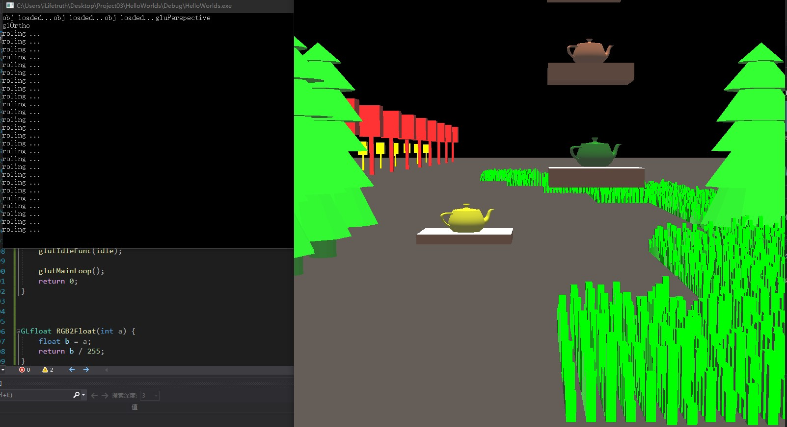
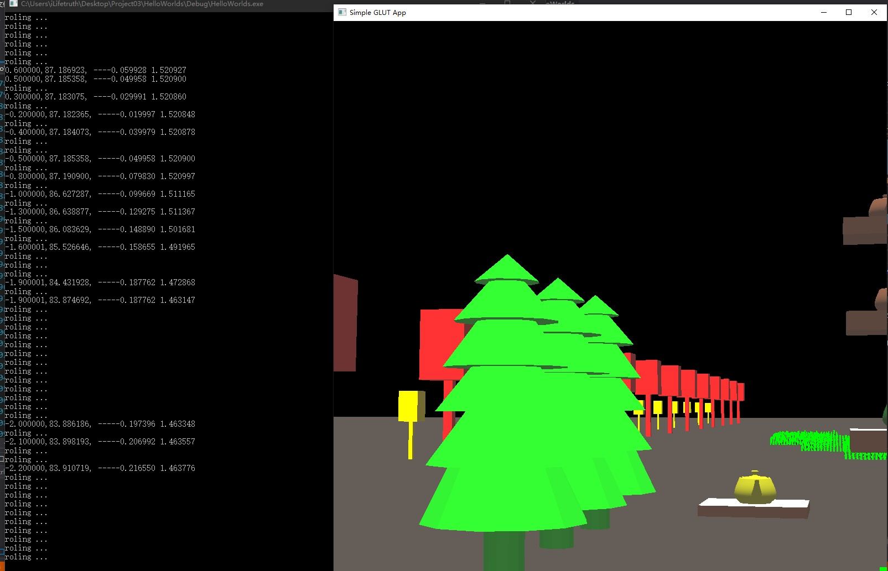
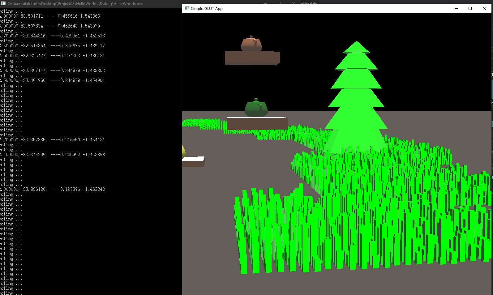
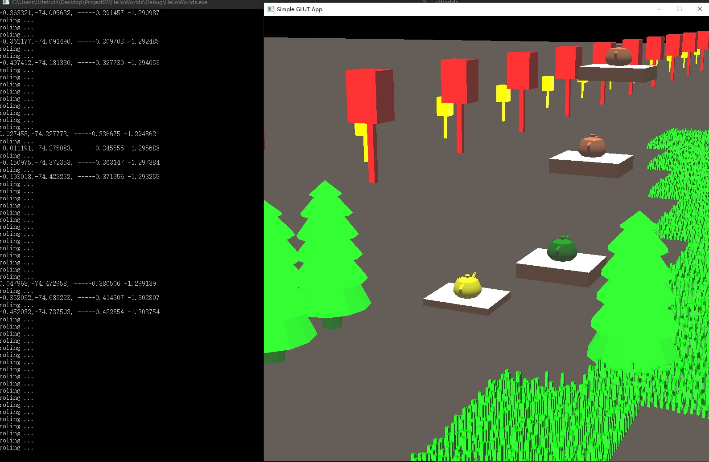
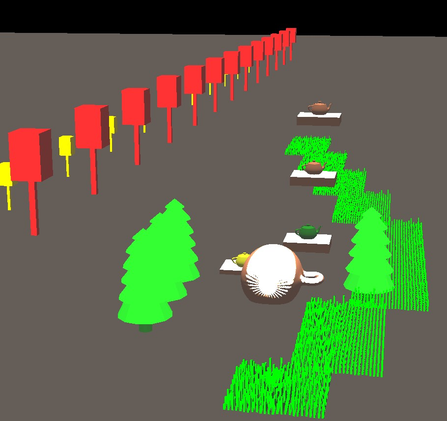
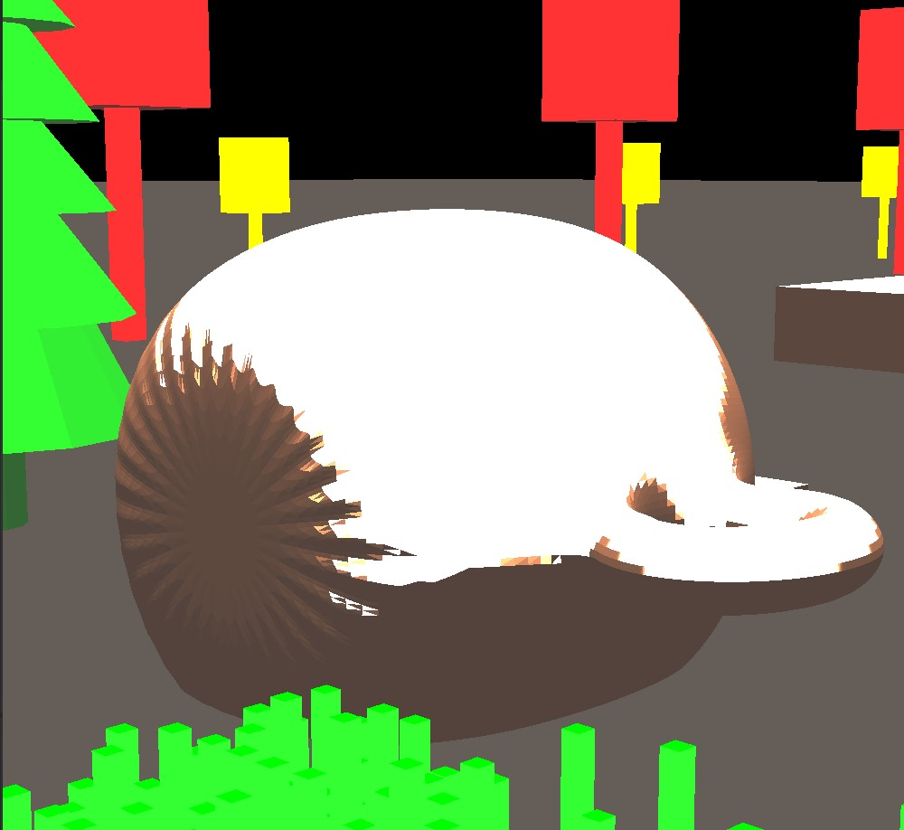
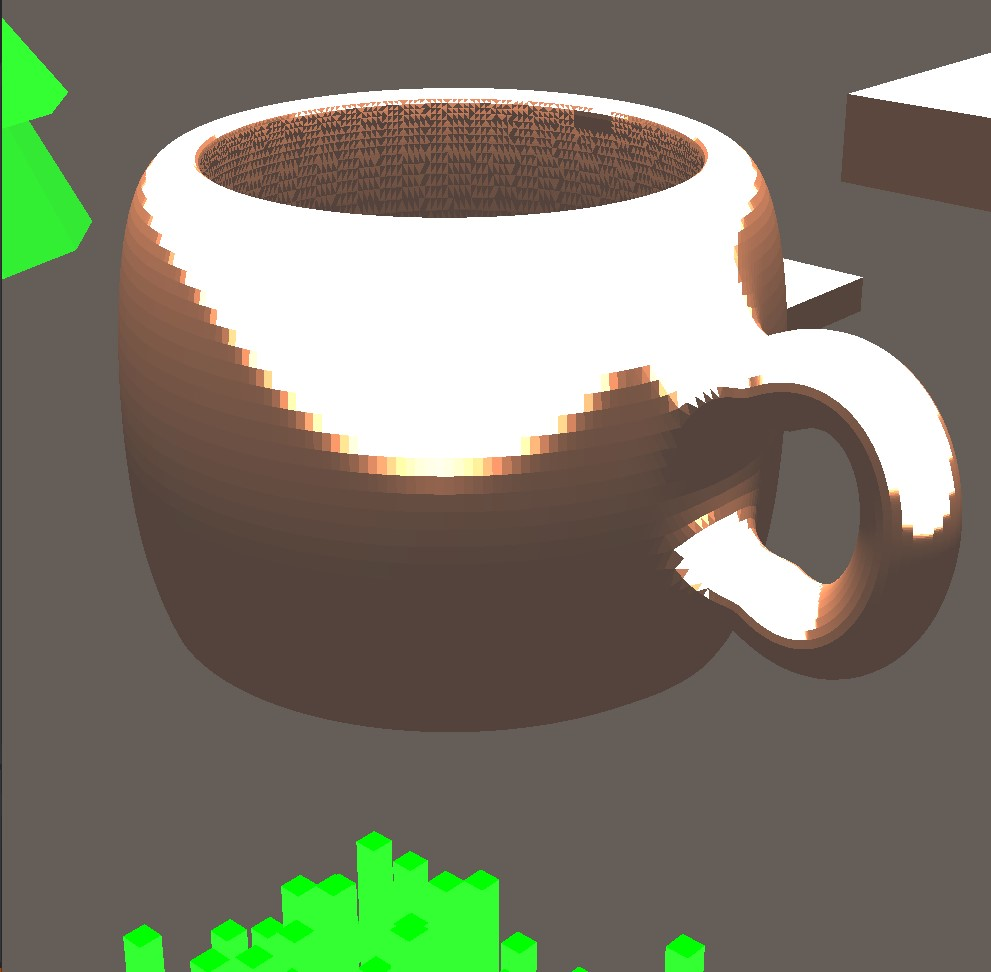
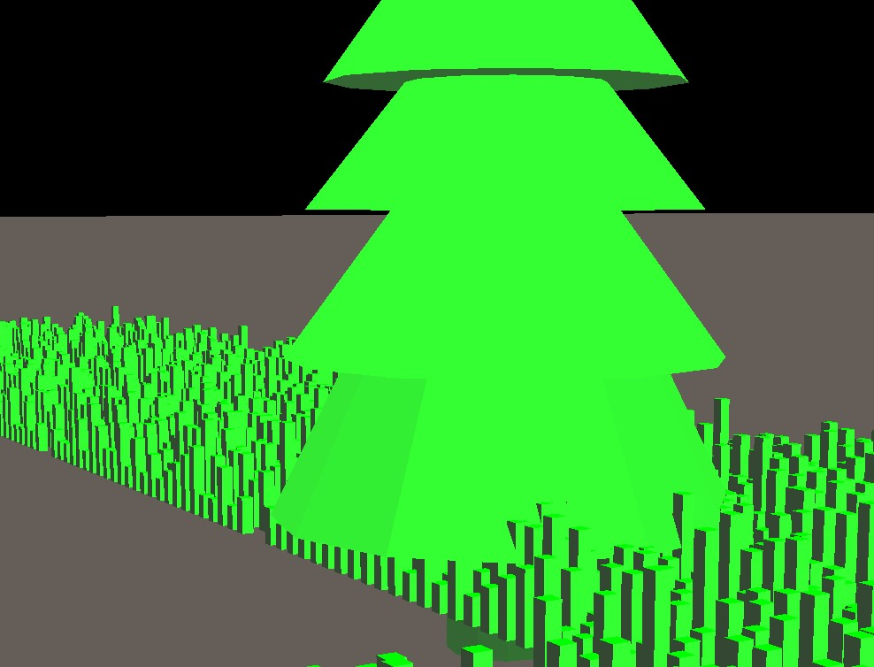
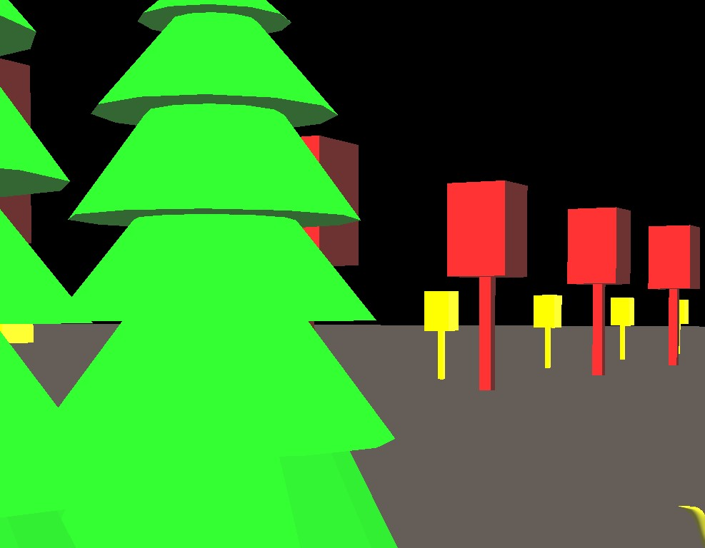
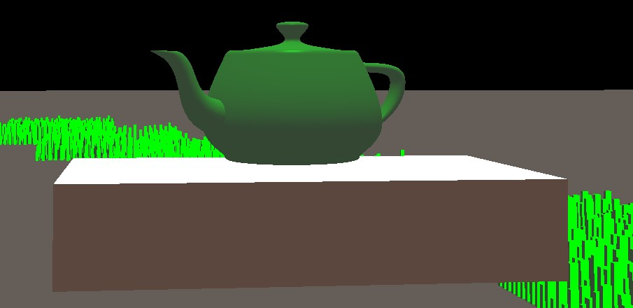

## 1.实验要求
复杂三维模型显示，提交时间：2020年1月8日
### 1.1 支持以下三维模型文件格式中至少1种：
+ OBJ <--本次实验所采用的模型格式
+ 3DS
+ STL
### 1.2 支持多个光源的光照效果，使用着色器渲染
### 1.3 支持多种视点浏览方式
以模型为中心的平移旋转和缩放
以视点为中心的场景漫游


## 2. 实验环境
+ Windows 10
+ Microsoft Visual Studio Community 2019 版本 16.7.0：
+ OpenGL环境框架：glut


## 3. 实验效果
本次实验中载入的模型如下
HelloWorlds\grass.obj ：用于草地的模拟
HelloWorlds\tree-1.obj ：用于松树的模拟
HelloWorlds\tree-2.obj ：用于柏树的模拟
HelloWorlds\Mug.obj ：用于杯子的模拟

实验运行效果如下：
### 3.1 进入场景

### 3.2 场景漫游（以视点为中心的场景漫游）





### 3.3 多角度观察复杂3D模型



### 3.4 漫游近距离观察其他模型


### 3.5 以模型为中心的观察（以模型为中心的平移旋转和缩放）



## 4. 实验主要代码

位于 `C:\Users\iLifetruth\Desktop\Project03\HelloWorlds\HelloWorlds\HelloWorld.cpp`
### 4.1 添加鼠标事件处理:

void MousFunc(int Button, int State, int X, int Y)
+ Button：表示点击的按键，GLUT_LEFT_BUTTON等
+ State：表示按键的状态，GLUT_DOWN等
+ X、Y：表示点击的位置
+ 只有鼠标键按下/松开时会调用
Void PassiveMotion(int X, int Y)
+ 处理一般的鼠标移动的函数

所有坐标都是在屏幕的像素坐标系下的坐标（左上角为原点）
### 4.2 添加整体场景的绘制
详见`Draw_Scene()`
### 4.2 添加各个3D模型的独立光照，以及颜色样式

```c
GLfloat RGB2Float(int a) {
	float b = a;
	return b / 255;
}


void style_Grass()
{
	GLfloat mat_specular[] = { RGB2Float(0), RGB2Float(100), RGB2Float(0), 1.0 };
	GLfloat mat_shininess[] = { 1000.0 };
	GLfloat lmodel_ambient[] = { RGB2Float(0), RGB2Float(100), RGB2Float(0), 1.0 };
	GLfloat light[] = { 0.8, 0.8,0.8, 1.0 }; 


	glMaterialfv(GL_FRONT, GL_SPECULAR, mat_specular);// 将会使物体在有绿色成分的光照下表现为绿色。
	glMaterialfv(GL_FRONT, GL_SHININESS, mat_shininess);
	glMaterialfv(GL_FRONT, GL_DIFFUSE, lmodel_ambient);
	glLightModelfv(GL_LIGHT_MODEL_AMBIENT, lmodel_ambient);
}


void style_Ground()
{
	GLfloat mat_specular[] = { RGB2Float(250), RGB2Float(215), RGB2Float(185), 1.0 };
	GLfloat mat_shininess[] = { 1000.0 };
	GLfloat lmodel_ambient[] = { RGB2Float(250), RGB2Float(215), RGB2Float(185), 1.0 };
	GLfloat white_light[] = { 1.0, 1.0,1.0, 1.0 };


	glMaterialfv(GL_FRONT, GL_SPECULAR, mat_specular);
	glMaterialfv(GL_FRONT, GL_SHININESS, mat_shininess);
	glMaterialfv(GL_FRONT, GL_DIFFUSE, lmodel_ambient);
	glLightModelfv(GL_LIGHT_MODEL_AMBIENT, lmodel_ambient);
}

void style_stool()
{
	GLfloat mat_specular[] = { RGB2Float(160), RGB2Float(82), RGB2Float(45), 1.0 };
	GLfloat mat_shininess[] = { 1000.0 };
	GLfloat lmodel_ambient[] = { RGB2Float(160), RGB2Float(82), RGB2Float(45), 1.0 };
	GLfloat white_light[] = { 1.0, 1.0,1.0, 1.0 };


	glMaterialfv(GL_FRONT, GL_SPECULAR, mat_specular);
	glMaterialfv(GL_FRONT, GL_SHININESS, mat_shininess);
	glMaterialfv(GL_FRONT, GL_DIFFUSE, lmodel_ambient);
	glLightModelfv(GL_LIGHT_MODEL_AMBIENT, lmodel_ambient);
}
```


